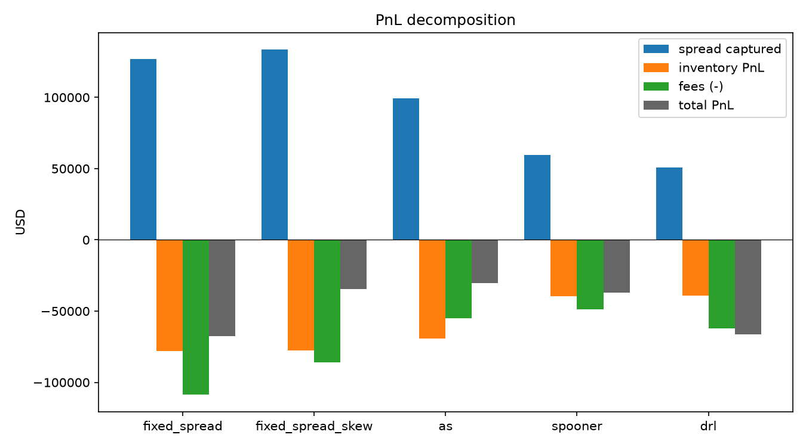

# Kalshi Market Microstructure & Market Making

An event-driven research platform for studying liquidity provision in Kalshi
sports prediction markets. The project combines a live Level-2 order-book
pipeline, a calibrated counterfactual fill model, and a shared backtesting
engine for classical and reinforcement-learning market makers.

The checked-in strategy study uses NBA pregame moneyline markets. The live L2
recorder was deployed against MLB markets to collect the order-book data that
Kalshi does not make available historically.

## Key result: fees are the binding constraint

In the stored 2025–26 NBA evaluation (`2,895` market episodes), the calibrated
Avellaneda–Stoikov strategy reduced the average loss by **55.4%** relative to
the fixed-spread benchmark (`-$10.44` versus `-$23.39` per episode) while
reducing mean absolute inventory by **83.5%** (`75.4` versus `458.4` contracts).

More importantly, the strategy paid `$54.8k` in modeled exchange fees. Holding
its quotes and fills fixed, adding those fees back changes aggregate PnL from
`-$30.2k` to **+$24.6k before fees**, or **+$8.51 per market episode**. Within
this backtest, a straightforward calibrated Avellaneda–Stoikov strategy has
positive pre-fee economics; the exchange fee schedule is the main barrier to
net profitability.

Full outputs are checked into
[`results/nba_2025-26`](results/nba_2025-26/summary.csv).



## Research setup

The historical study uses Kalshi's one-minute bid/ask candles and full trade
tape for NBA pregame moneyline markets. The pipeline infers tip time, builds a
chronological pregame event stream, calibrates volatility and fill intensity,
and evaluates every strategy through the same event-driven engine.

Because Kalshi does not provide historical order-book depth, a separate live
recorder was deployed on MLB markets. It ingests `orderbook_delta` and `trade`
messages, reconstructs each book from snapshots and deltas, reconnects on
sequence gaps, and writes near-touch observations to SQLite or Postgres. The
recorded L2 data is used to validate the backtest's queue and depth assumptions.

## Fill probability model

Kalshi exposes historical one-minute bid/ask candles and the trade tape, but
not historical depth or queue position. The simulator therefore combines two
fill mechanisms:

1. **Tape-anchored fills.** A trade through the strategy's quote fills the
   quote; a trade at a joined touch fills a configurable queue share `rho`;
   a trade at a price-improving quote fills it before the old touch. These
   fills are tied directly to observed market activity.
2. **Latent fill probability (optional).** A price-improving quote may attract
   flow that did not occur in the historical tape. The model estimates an
   incremental arrival intensity `lambda` from observed trade rates by quote
   distance and time to tip. Over an interval `dt`, the probability of a fill
   is `1 - exp(-lambda * dt)`. Synthetic volume is capped to limit
   extrapolation.

## PnL accounting

All strategies share the same fill engine, fee schedule, inventory cap, event
stream, and terminal accounting. PnL decomposes as:

```text
PnL = spread captured + inventory PnL - fees
```

## Strategies

- **Fixed Spread** joins or improves the touch around the current midpoint,
  with an optional linear inventory skew.
- **Avellaneda–Stoikov** adapts its reservation price and spread to inventory,
  bounded local volatility, time to tip, and calibrated arrival intensity.
- **Spooner RL** uses SARSA(λ) with tile-coded inventory, spread, flow,
  volatility, time, and price-location features.
- **Deep RL** uses a temporal-convolution dueling double DQN with n-step
  returns and pluggable inventory-aware rewards.

## Repository layout

```text
kalshi_mm/
  api/          REST client, authentication, and historical downloads
  recorder/     live discovery, book reconstruction, and durable storage
  data/         normalization, event streams, and tip-time inference
  calib/        bounded volatility and fill-intensity estimation
  sim/          fees, fills, and the event-driven backtest engine
  strategies/   fixed spread, Avellaneda–Stoikov, SARSA, and DQN
  eval/         PnL decomposition, summary metrics, and plots
scripts/        numbered research workflow plus recorder/export utilities
models/         persisted RL policies and training histories
results/        checked-in evaluation tables and figures
```
